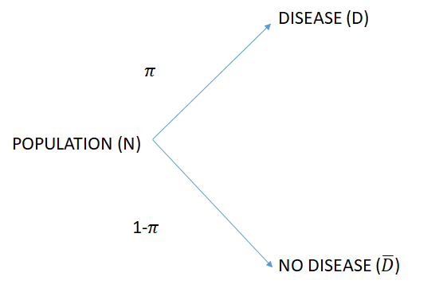
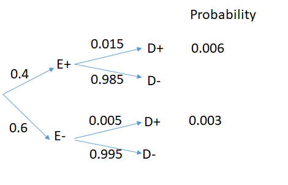
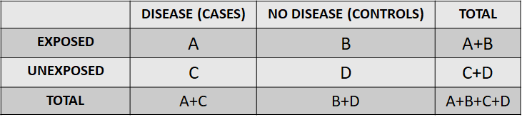

# EPIDEMIOLOGY -- A QUANTITATIVE SCIENCE

-   Epidemiology = obtain, interpret and use health information to
    promote health

-   Frequency and patterns of disease in people

-   Measures disease in people at risk and/or in populations

-   Potential associations of disease with harmful or protective
    exposures

-   Epidemiology scope

    -   Prevent (e. g. screening/vaccination)

    -   Reduce (interventions/therapies)

    -   Control, contain (contingency measures) and eventually eradicate

    -   Optimal resource allocation

# **ESSENTIAL CONCEPTS IN EPIDEMIOLOGY**

-   Individual = unit of interest in **clinical medicine**

-   Population = unit of interest in **epidemiology**

-   Population = a group of people, usually large, who share broad
    similarities

    -   Children,infants, neonatal population

    -   Population of a county/country/continent/**world**

    -   HIV population, TB population, cancer population

-   Questions addressed at population level

    -   **What** is the problem and its frequency

    -   **Who** is affected -- or rather what is the population
        affected?

    -   **When/Where** does the problem manifest

    -   **Why** does it occur?

-   Exposure

    -   **Harmful**: biological (an infective agent), environmental (air
        pollution, excessive sun), occupational hazard, lifestyle
        (smoking, alcohol), inherited (fair skin, blood group A, genetic
        traits)

    -   **Protective**: vaccination, chemical therapy, lifestyle
        (healthy eating, moderate exercise)

-   Question and main concepts

    -   Define and measure the [***outcome:***]{.ul} (lung cancer
        occurrence)

    -   Define and measure the potential [***exposure:***]{.ul} (number
        of years smoking)

    -   Hypotheses tests-- [**association**]{.ul} between
        [**outcome**]{.ul} (disease) and [**exposure**]{.ul}

# **Measuring the disease in the population (1)**

-   **Absolute measures** -- to understand disease burden or populations
    characteristics

    -   Proportions

        -   Categorical/binary data

        -   Associated Concepts: **risk** of disease or **prevalence**
            of a disease in the population

        -   Example: obesity **risk/prevalence** in a population,
            risk/prevalence of breast cancer in women

    -   Means

        -   Apply to quantitative data

        -   Carefully inspect the distribution for relevant statistics
            -- consider data transformation

        -   Example -- mean blood pressure in the population, mean
            height in adult men/women

    -   Rates -- number of events within a fixed time interval

        -   Monthly number of infections (a fast dynamic one)

-   **Relative measures -- ratios and differences**

    -   **Rationale in a nutshell**: effect of an exposure in different
        groups in the population

    -   Effect of intervention on blood pressure in men vs. women

    -   Effect of intervention on proportion of success in age groups:
        children vs. adults

    -   Reference values for ratios: 1 and for differences: 0

# **Measuring the disease in the population - examples**

-   [***ABSOLUTE MEASURES***]{.ul}: Risk, odds, rates in a population

    -   RISK=$\pi$=diseased number/population number - (always between 0
        and 1)
    -   ODDS=$\frac{\pi}{(1-\pi)}$ -(always positive, can be greater
        than 1 and is mathematically more convenient to handle)



-   **THE RISK PARAMETER**

    -   $\pi$ = also called the **risk of disease** of this very simple
        binary probability model

    -   can also be the prevalence of the disease in the population

    -   $\pi = \frac{D}{N} = \frac{D}{(D+\bar{D}}$

-   **THE ODDS PARAMETER**

    -   $\Omega=\frac{\pi}{(1-\pi)}=\frac{\frac{D}{N}}{1-\frac{D}{N}} =\frac{\frac{D}{N}}{\frac{N-D}{N}} = \frac{D}{N-D}= \frac{D}{\bar{D}}$

    -   $\pi=\frac{\Omega}{(1+\Omega)}$

-   ACCOUNTING FOR A KNOWN EXPOSURE

    

-   [***RELATIVE MEASURES***]{.ul}: Risk ratios, odds ratios, rated
    assessing patterns of association between groups in the population

    -   RELATIVE RISK=RR=$\frac{\pi_{exposed}}{\pi_{nonexposed}}$ -
        (always\>0)

    -   ODDS RATIOS=OR=$\frac{ODDS_{exposed}}{ODDS_{nonexposed}}$
        -(always\>0)

    -   In the example above RR=2, OR\~2 - always the case in rare
        disease situation (prevalence less than 5% in the population)

```{r}
disease<-c(60, 40) ##create the disease vectors
non_disease<-c(100,300) ##create the disease vectors
total<-disease+non_disease ##create the total vectors
total
two_by_two_table<-rbind(disease, non_disease) ##bind them in a table so chi squared R
two_by_two_table ##display the table

oddsratio(two_by_two_table, method = "wald")
```

```{r}
disease<-c(60, 40) ##create the disease vectors
non_disease<-c(100,300) ##create the disease vectors
total<-disease+non_disease ##create the total vectors
total
two_by_two_table<-rbind(disease, non_disease) ##bind them in a table so chi squared R
two_by_two_table ##display the table

help(riskratio)
riskratio(two_by_two_table, rev = "both", method = "wald")
```

```{r}
x <- data.frame(Cases=c(60, 40),Control=c(100, 300))
rownames(x) <- c("Smokers","Non smokers")
x
mosaicplot(t(x), col = c("firebrick", "goldenrod1"), cex.axis = 1, sub = "Disease", ylab = "Relative frequency", main = "")
table2x2(x)
```

# **A GENERIC 2 by 2 table**



-   The [***odds***]{.ul} of the [**disease**]{.ul} in the
    [**exposed**]{.ul} group is:
    $$\frac{\frac{A}{A+B}}{1-\frac{A}{A+B}}=\frac{\frac{A}{A+B}}{\frac{B}{A+B}}=\frac{A}{B}$$

-   The [***odds***]{.ul} of the [**disease**]{.ul} in the
    [**unexposed**]{.ul} group is:
    $$\frac{\frac{C}{C+D}}{1-\frac{C}{C+D}}=\frac{\frac{C}{C+D}}{\frac{D}{C+D}}=\frac{C}{D}$$

-   The [***odds***]{.ul} of the [**exposure**]{.ul} in the
    [**disease**]{.ul} group is:
    $$\frac{\frac{A}{A+C}}{1-\frac{A}{A+C}}=\frac{\frac{A}{A+C}}{\frac{C}{A+C}}=\frac{A}{C}$$

-   The [***odds***]{.ul} of the [**exposure**]{.ul} in the
    [**no-disease**]{.ul} group is:
    $$\frac{\frac{B}{B+D}}{1-\frac{B}{B+D}}=\frac{\frac{B}{B+D}}{\frac{D}{B+D}}=\frac{B}{D}$$

-   The [***OR of the disease for exposed vs.non exposed***]{.ul}:

$$\frac{\frac{A}{B}}{\frac{C}{D}}=\frac{{A}\times{D}}{{B}\times{C}} $$

-   The [***OR of the exposure in diseased vs. non-diseased:***]{.ul}
    $$\frac{\frac{A}{C}}{\frac{B}{D}}=\frac{{A}\times{D}}{{B}\times{C}} $$

-   The precision of the estimate - that IS STATISTICS!
    $$$SE(ln(OR))=\sqrt{\frac{1}{A}+\frac{1}{B}+\frac{1}{C}+\frac{1}{D}}$$

-   The uncertainty of the $ln(OR)$, i.e. the 95%CI is
    $$ln(\frac{{A}\times{D}}{{B}\times{C}})-1.96\times \sqrt{\frac{1}{A}+\frac{1}{B}+\frac{1}{C}+\frac{1}{D}},      ln(\frac{{A}\times{D}}{{B}\times{C}})+1.96\times \sqrt{\frac{1}{A}+\frac{1}{B}+\frac{1}{C}+\frac{1}{D}}$$

```{=html}
<!-- -->
```
-   When referring to the OR of the disease

    -   If OR \>1 - the exposure is harmful

    -   If OR \>1 - the exposure is protective
