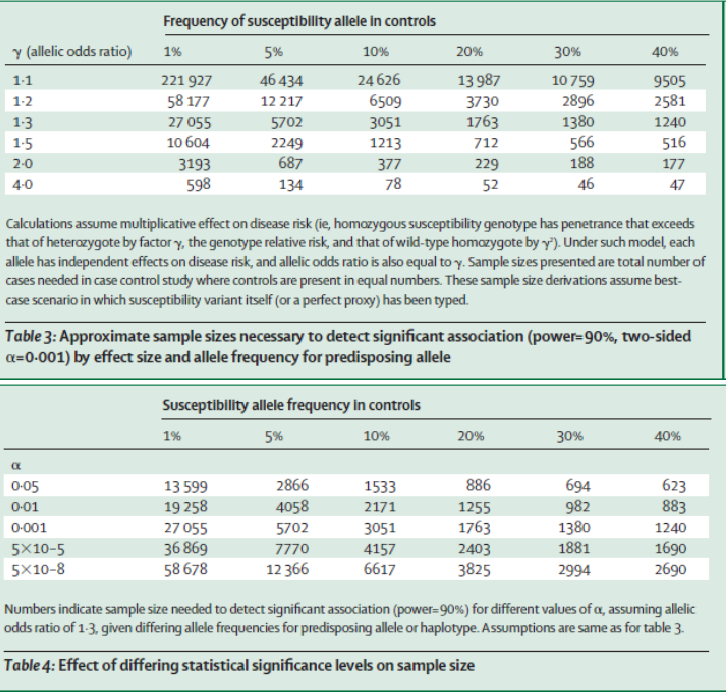
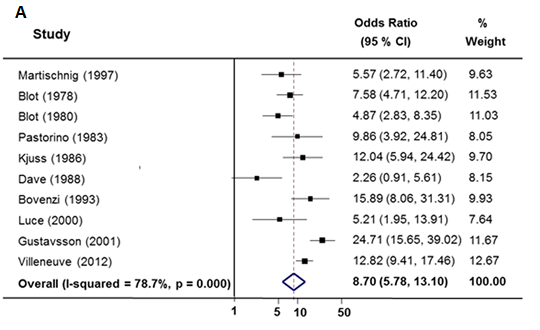
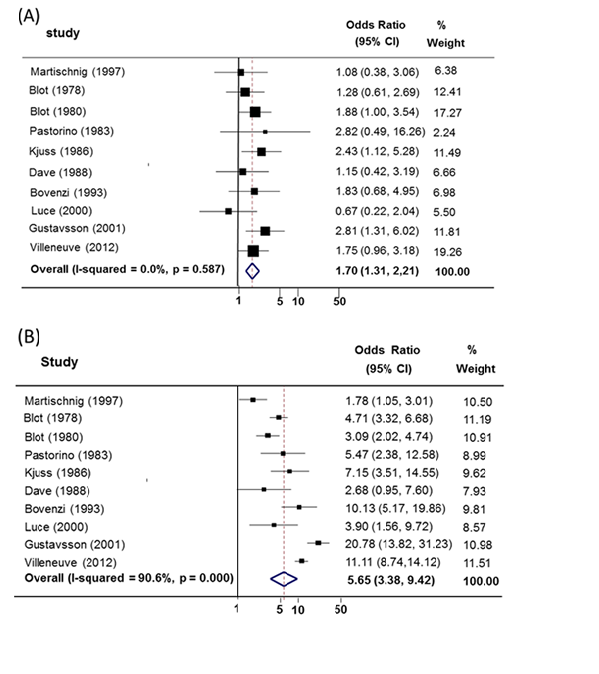

## MAIN TYPES OF EPIDEMIOLOGICAL RESEARCH 

-   Observational

-   Descriptive

    -   Aggregated level -

    -   Individual level

-   Analytical

    -   Ecological - mortality from coronary heart disease in local
        authority areas of England and Wales has been correlated with
        neonatal mortality in the same places 70 and more years earlier.

    -   Surveillance -Public health surveillance is the ongoing
        systematic collection, analysis, and interpretation of data,
        closely integrated with the timely dissemination of these data
        to those responsible for preventing and controlling disease and
        injury

    -   Cohort (longitudinal) -birth cohorts

    -   Cross-sectional

    -   Case-control studies

-   Experimental: Randomized control trials

-   A great deal of studies are broadly association studies, i.e. aiming
    at investigating associations between some [***exposure***]{.ul} and
    some [***disease***]{.ul}

-   Two central challenges: [***bias and confounding***]{.ul} Generally
    impossible to discard completely but possible to minimise them

## Cohort studies vs. case control studies

-   Both case-control and cohort studies have similar goals , i.e., to
    estimate the magnitude of association between an exposure and an
    outcome.

-   Cohort studies -- both absolute and relative measures

-   Case control studies -- only relative measures -- odds ratios (OR)

-   Cohort studies:

    -   Often following up people for a considerable time to find out an
        answer

    -   Expensive or very difficult to obtain exposure information from
        a cohort.

    -   Problematic when one is investigating outcomes that only occur
        in a small fraction of exposed and unexposed individuals.

-   Case-control design offers an alternative that is much more
    efficient.

-   Case-control studies employ a different sampling strategy that gives
    them greater efficiency.

-   **Resemblance:** associations between exposure and disease

-   **Difference:** subjects recruitment

-   Cohort: follow up registers subjects who develop the disease and
    those who remain free of disease

-   Case-control: cases registered by other mechanisms than that of
    follow up and a group of healthy subjects (controls) is used to
    represent those who did not develop the disease

    -   An underlying cohort (study base) supplies the case and controls
        needed

    -   Selection of cases and controls mechanism difficult and often
        abused

    -   Properly conducted produce correct estimates of the effect of an
        exposure

    -   [***The probability that a case in registered is assumed to be
        the same for both exposed and non exposed groups and the
        probability that a healthy subject is chosen must be the
        same***]{.ul}

    -   TRADITIONALLY - ONLY A RELATIVE MEASURE OF ASSOCIATION CAN BE
        DERIVED AND THAT IS THE ODDS RATIO

## ADVANTAGES OF CASE-CONTROL STUDIES

-   Cost effective relative to other analytical studies such as cohort
    studies.

-   Case-control studies can have a retrospective efficient design, i.e.
    cases are identified at the beginning of the study; therefore there
    is no long follow up period (as compared to cohort studies).

-   Efficient for the study of diseases with long latency periods.

-   Efficient for the study of rare diseases.

-   Good for examining multiple exposures.

## DISADVANTAGES OF CASE-CONTROL STUDIES

-   Particularly prone to bias; especially selection, recall and
    observer bias.

-   Case-control studies are limited to examining one outcome (albeit
    multiple exposures).

-   Not suitable to estimate risk of disease (unless study is population
    based).

-   Poor choice for the study of rare exposures.

-   The temporal sequence between exposure and disease may be difficult
    to determine.

## THE QUALITY OF A STUDY IN CLASSICAL EPIDEMIOLOGY

-   Question: how good is a study? What are the concepts which measure
    its quality?

-   Appropriate study design and population representation -- NECESSARY
    BUT NOT SUFFICIENT

-   Three elements intrinsically related, which should be reported all
    together and which are the determinants of the [***minimum necessary
    sample size***]{.ul} under the considerations below

    -   Type 1 error - the smaller the desired type 1 error - the larger
        the sample size required

    -   Type 2 error - larger the power (the smaller the type 2 error)
        -- the larger the required sample size

    -   The effect size:

        -   at its simplest, this is the difference (ratio) between two
            groups (case and controls) we hypothesise a priori and which
            is epidemiological, clinically, biologically relevant

        -   The smaller the effect size -- the larger the sample size
            required

-   Any study should be discussed and understood in this context

-   A variety of methodologies for sample size calculation apply
    --mainly depending on [***study design***]{.ul} and the [***nature
    of the outcome***]{.ul} for which we seek evidence

## THE QUALITY OF A STUDY IN GENETIC EPIDEMIOLOGY

-   Principles from classical epidemiology still hold

-   Genetic association studies have two main stages:
    [***exploratory***]{.ul} and [***confirmatory***]{.ul}

-   The later (confirmatory/replication) stage -- source of frustration
    and confusion has been the frequency with which initial positive
    findings are not confirmed.

-   How good a candidate is the gene?

-   Since there are up to 30 000 genes in the human genome, and it is
    unlikely that more than a few hundred make a meaningful contribution
    to variation in any single phenotype, the a priori probability that
    any gene selected at random will influence a given trait is very
    low.

-   Small initial studies rarely find the correct result, and even when
    they do are likely to overestimate the true effect size.

If such an under-powered study generates positive findings, those will
need to be replicated in a second, ideally larger, sample.EPIDEMIOLOGY
-- A QUANTITATIVE SCIENCE

## 

## ADVANTAGES OF CASE-CONTROL STUDIES

-   Cost effective relative to other analytical studies such as cohort
    studies.

-   Case-control studies can have a retrospective efficient design, i.e.
    cases are identified at the beginning of the study; therefore there
    is no long follow up period (as compared to cohort studies).

-   Efficient for the study of diseases with long latency periods.

-   Efficient for the study of **rare diseases**.

-   Good for examining **multiple exposures**.

## DISADVANTAGES OF CASE-CONTROL STUDIES

-   Particularly prone to bias; especially selection, recall and
    observer bias.

-   Case-control studies are limited to examining one outcome (albeit
    multiple exposures).

-   Not suitable to estimate risk of disease (unless study is population
    based).

-   Poor choice for the study of **rare exposures**.

-   The temporal sequence between exposure and disease may be difficult
    to determine.

## THE QUALITY OF A STUDY IN CLASSICAL EPIDEMIOLOGY

-   Question: how good is a study? What are the concepts which measure
    its quality?

-   Appropriate study design and population representation -- NECESSARY
    BUT NOT SUFFICIENT

-   Three elements intrinsically related, which should be reported all
    together and which are the determinants of the [***minimum necessary
    sample size***]{.ul} under the considerations below

    -   [***Type 1 error***]{.ul} - the smaller the desired type 1
        error - the larger the sample size required

    -   [***Type 2 error***]{.ul} - larger the power (the smaller the
        type 2 error) -- the larger the required sample size

    -   [***The effect size:***]{.ul}

        -   at its simplest, this is the difference (ratio) between two
            groups (case and controls) we hypothesise a priori and which
            is epidemiological, clinically, biologically relevant

        -   The smaller the effect size -- the larger the required
            sample size

-   Any study should be discussed and understood in this context

-   A variety of methodologies for sample size calculation apply
    --mainly depending on [***study design***]{.ul} and the [***nature
    of the outcome***]{.ul} for which we seek evidence

## THE QUALITY OF A STUDY IN GENETIC EPIDEMIOLOGY

-   Principles from classical epidemiology still hold

-   Genetic association studies have two main stages:
    [***exploratory***]{.ul} and [***confirmatory***]{.ul}

-   The later (confirmatory/replication) stage -- source of frustration
    and confusion has been the frequency with which initial positive
    findings are not confirmed.

-   How good a candidate is the gene?

-   Since there are up to 30 000 genes in the human genome, and it is
    unlikely that more than a few hundred make a meaningful contribution
    to variation in any single phenotype, the a priori probability that
    any gene selected at random will influence a given trait is very
    low.

-   Small initial studies rarely find the correct result, and even when
    they do are likely to overestimate the true effect size.

-   If such an under-powered study generates positive findings, those
    will need to be replicated in a second, ideally larger, sample.



*The Lancet -- Genetic Epidemiology series Genetic epidemiology 5 What
makes a good association study? By Andrew T Hattersley, Mark I McCarthy*

**Combined evidence from multiple studies is particularly desirable**

# Meta analyses

## Generalities

-   Meta-analysis is a statistical procedure for combining data from two
    or more studies usually designed and conducted in a similar manner,
    i.e. case-control studies looking at association between the same
    exposure and the same outcome/condition/disease.

-   Often applied to pool evidence from multiple clinical trials but not
    only

-   Data needed for a pooled odds ratios: No cases in exposed group (can
    be treatment) No cases in the unexposed group No of non cases in the
    exposed group (or total no of participants) No of non cases in the
    non exposed group (or total no of participants)

-   When the treatment effect (or effect size) is consistent from one
    study to the next, meta-analysis can be used to identify this common
    effect quantified by the pooled odds ratios.

-   When the effect varies from one study to the next, meta-analysis may
    be used to identify the reason for the variation.

-   Rationale: Increased power to understand the effect of an exposure
    on an outcome

-   The analysis of the analyses



-   Interpretation

-   Vertical black line -- reference value of 1 for OR

-   Vertical red line -- the value of the pooled OR

-   The squares

    -   do NOT reflect the magnitude of the OR

    -   do reflect the contribution of each study to the overall
        estimate

    -   do reflect the size of the study

-   The horizontal lines -- study uncertainty (95%CI for individual
    studies)

-   The larger the black square

    -   the larger the study

    -   the larger the contribution to the pooled estimate

    -   the shorter the individual horizontal line --the more precise
        the estimate

    -   the larger the weighted contribution - not always present

-   I-squared reflects the degree of heterogeneity between studies

-   Rule of thumb- how different the studies are in their results

    -   0% to 40%: might not be important

    -   30% to 60%: may represent moderate heterogeneity

    -   50% to 90%: may represent substantial heterogeneity

    -   75% to 100%: considerable heterogeneity

-   The [***null hypothesis is that of homogeneity of the
    studies***]{.ul}, i.e. no heterogeneity. The p-values within the
    overall brackets refers to this test.

    -   if p\<0.05, that is evidence against [***no
        heterogeneity***]{.ul}

    -   whilst p\>0.05 says that the data are consistent [***with no
        heterogeneity***]{.ul}.

-   Conclusions:

-   If there is strong evidence for between studies heterogeneity, the
    pooled estimate (OR), even statistically significant, may be
    questionable. Further investigation is necessary to understand the
    sources of heterogeneity.

-   If there is no evidence for heterogeneity, the pooled estimate and
    associated uncertainty are likely to be valid



Non--smoking:

-   Pooled odds ratio of asbestos-exposed compared with not
    asbestos-exposed.

-   No evidence against heterogeneity (I=0% and p=0.587)

-   Significant association between exposure 1.70(1.31, 2.21) and
    disease as the uncertainty is on the right side of the reference
    line of 1.

-   The greatest contribution to the overall estimate is made by
    Villeneuve (2012), the smallest by Pastorino (1983).

Smoking:

-   Pooled odds ratio of asbestos-exposed compared with not
    asbestos-exposed.

-   Somewhat strong evidence for the presence of heterogeneity amongst
    studies. The greatest contributor Villeneuve (2012), the smallest
    Dave (1988)

-   Note that whilst all studies except for 1 (Dave 1988) are on the
    right side of the reference line, suggesting some consistency, the
    magnitude of the overall estimate might be questionable given the
    presence of a high level of heterogeneity.

-   What to do? Investigating sources of heterogeneity

-   Eliminate extremes and re-run

```{r }
#dat.bcg<-read.table("BCG.txt", sep=",")
dat.bcg
```

```{r }
help(escalc)
dat1 <- escalc(measure="OR", ai=tpos, bi=tneg, ci=cpos, di=cneg, data=dat.bcg)
dat1

help(rma)
res1 <- rma(yi, vi, data=dat1)
res1
```

```{r }
predict(res1, transf=exp, digits=2)

forest(res1) ##the default at log scale
forest(res1, atransf = exp) ##the default back transformed

forest(res1, slab = paste(dat1$author, dat1$year, sep = ", "), 
xlim = c(-16, 6), at = log(c(0.05, 0.25, 1, 4)), atransf = exp,
ilab = cbind(dat1$tpos, dat1$tneg, dat1$cpos, dat1$cneg),
ilab.xpos = c(-9.5, -8, -6, -4.5), cex = 0.75)
op <- par(cex = 0.75, font = 2)
text(c(-9.5, -8, -6, -4.5), 15, c("Exp+", "Exp-", "Exp+", "Exp-"))
text(c(-8.75, -5.25), 16, c("Cases", "Controls"))
text(-16, 15, "Author(s) and Year", pos = 4)
text(6, 15, "Odds Ratios [95% CI]", pos = 2)
text(-14, -1, pos=4, cex=0.75, 
bquote(paste(" (Q = ",.(formatC(res1$QE, digits=2, format="f")), 
                        ", p = ", .(formatC(res1$QEp, digits=2, format="f")), "; 
             ", I^2, " = ", .(formatC(res1$I2, digits=1, format="f")), "%)")))
par(op)

##some departure from normality
qqnorm(res1, main = "Random-Effects Model")

rtf <- trimfill(res1)
funnel(rtf)

```

# Genetic case-control studies

-   Closely allied to classical epidemiology

-   Joint effect of genes and non-genetic determinants

-   Key: continuous computational development and data storage
    availability

-   Ancestral - in particular genetic - determinants of the disease

-   Hence TIME is less of an issue in these studies as the genetic
    heritage does not change

## Genetic wide association studies (GWAS) -- case-control studies

-   Time is of no relevance in GWAS

-   Genes -- DNA component

-   Important exposures in genetic association studies are rather
    inherited

    -   Ethnicity

    -   Gender

    -   Ancestry

    -   Geographical location

-   Other aspects possibly contributing to explaining disease

    -   Life style

    -   Socio-economic aspects

    -   Comorbidities
