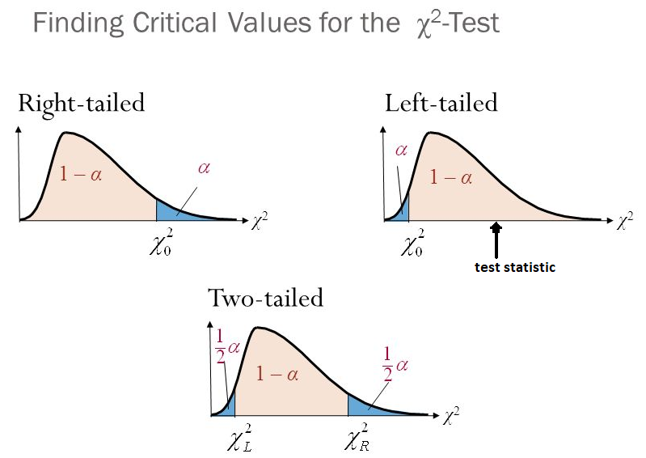
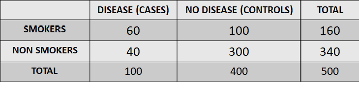
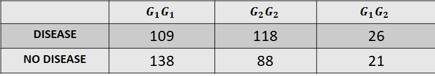

```{r setup, include=FALSE}
knitr::opts_chunk$set(echo = TRUE)
```

# DATA DESCRIPTIVE SUMMARY

-   **Data types in statistics**

    -   **Quantitative**

        -   Continuous (weight, height, age, blood pressure)

        -   Discrete (number of car accidents/week)

        -   Summary:

            -   Means, Medians -- central tendency

            -   Standard deviation - spread of the data at hand

            -   Q1 -first and Q3 - third interquartile further
                information on location and spread of the data

            -   Range, min, max - measures of location

        -   Visualize: histograms, box plots 

    -   **Qualitative**

        -   Ordinal (severity of a diseases, Likert scale of agreement)

        -   Nominal (gender, presence/absence of disease, blood group)

        -   Summary:

            -   Proportions (no standard deviations!)

        -   Visualize: bars of frequencies or percentages

-   **Data summary: an assessment, a succinct and relevant communication
    on data at hand -- purely descriptive and restricted to the sample
    we work on**

# INFERENTIAL CONCEPTS

-   **Inference: A statistical process aiming at drawing conclusions to
    larger populations - those the samples are coming from. Correctly
    designed, studies aim at producing generalizable results of
    numerical characteristics of the population.**

-   **Hypotheses tests** - understanding the extent to which our
    observations may be attributable to chance

    -   Null hypothesis

    -   Alternative hypothesis

-   **Parameter estimates** - quantities derived assuming a very large
    number of repetitions

    -   means, proportions

    -   risk, rates, odds

    -   prevalence and incidence

-   **P-values** - probabilities

    -   measure the strength of the evidence against the null

    -   measure how far is the sample data distribution from that in the
        population

-   **Standard errors** - measures of precision of the parameter
    estimates

-   **95% confidence intervals** - measures of uncertainty

# α-LEVEL of SIGNIFICANCE vs. p-VALUES

-   **α-level of significance**

    -   **prior to the experiment** **and/or conducting the test or part
        of study design -**there are no data or analyses data just yet 

    -   usually α=0.05 (but is can also be 0.01, 0.001, etc.) as we
        accept that there is only a 5 or 1 in 100 chance that the
        variation that we are seeing is due to chance.

    -   probability of incorrectly rejecting the null hypothesis in
        favor of the alternative when the null is in fact true (**Type 1
        error**)

    -   an accepted margin of error (usually 5%)- the researcher accepts
        a small probability that rejecting the null hypothesis might be
        a mistake.

-   **P-values**

    -   calculated from the data, **post data analyses** -- also called
        [**observed significance level**]{.ul}

    -   measures the **strength of the evidence against the null
        hypothesis** - the smaller the p-value the greater the evidence
        against the null

# **BINARY and CATEGORICAL data -- main focus of this presentation**

-   Real world data can be of various nature - [**quantitative**]{.ul}
    disease traits valuable

-   A great body of successful genetic studies are based on
    [**qualitative**]{.ul} disease traits

-   These type of outcomes dominate **genetic epidemiology** research -

-   Genetic population studies - it is very common that the data are
    presented as such

    -   Individuals are defined as either affected or not affected
        (**binary disease trait**)

    -   Classed as of different genotypes (genetic susceptibilities
        categories)

    -   Understanding data nature is crucial as different statistical
        methodologies apply to different data types

# HYPOTHESIS TESTING - CATEGORICAL DATA

-   [**Standard deviation**]{.ul}**:** indicates the [**spread of the
    data at hand - concept associated to continuous**]{.ul}

    -   [**SE of the mean= SD of the *sample mean,***]{.ul} ***i.e.***
        $SE=SD/sqrt(n)$ - n is the size of the sample data at hand

        -   [**NO SUCH THING FOR CATEGORICAL DATA !**]{.ul}

-   [**Standard error:**]{.ul} indicates the [**precision of an estimate
    such as mean, proportion, etc. - specific to any targeted
    estimate**]{.ul}

## Before data analysis

-   One sample or two samples - dependent or independent ?

-   Critical region definition depends on

    -   **α-level of significance**

    -   **one-sided or two-sided hypothesis test**

## Given the data

-   **Test statistic**

    -   A quantity which uses what we observe from the data at hand (and
        potentially a values which we test against)

    -   Test statistic - a number which is placed on the X axis of a
        reference distribution

-   The test static calculation and the reference distribution
    [***depend on the data type***]{.ul} which needs to be recognized by
    the user

-   If R is sent the correct information and associated command - it
    will calculate the correct test statistic and will pick the correct
    reference distribution which would enable the user to correctly take
    decisions and interpret the findings

-   Categorical data tests are associated with Binomial distribution
    (small samples) or Chi-squared distribution (large samples)

    

## Hypothesis testing - categorical data examples

### One sample test for proportion -small numbers

-   A clinically relevant intervention for a particular severe infection
    requires 60% survival. When a new drug was administrated to a random
    sample of 15 patients with infection, 12 survived. Does this provide
    evidence that the new drug is effective?

    -   **The null hypothesis**: the drug is not effective

    -   **The alternative hypothesis**: the drug is effective

```{r}
  prop.test(12, 15,  p=0.6, alternative="greater", conf.level=0.95, correct=TRUE)
  binom.test(12, 15, p=0.6, alternative = c( "greater"), conf.level = 0.95)

```

-   **Interpretation:** the resulting p-value=0.09382. There is not
    enough evidence against the null; the data are consistent with the
    null.

-   What if the data consist of 3 survivors out of 5 ?

    -   Small data - different R command applies - R warns against wrong
        usage

```{r}
  binom.test(3, 5, p = 0.6, alternative = c( "greater"), conf.level = 0.95)
  prop.test(3, 5, p=0.6, alternative="greater", conf.level=0.95, correct=TRUE)
  
```

### One sample test for proportion -large sample

-   The Census Bureau reports that proportion of females in the US
    population is 0.508 (50.8%). A random sample from a particular state
    counts 5670 females out of 10000. Question: Is the proportion of
    women in this state different from that in the US population? What
    about a random sample of 1000 women which counts 567 women? Or a
    random sample of 100 women which counts 57 women?

    -   **The null hypothesis**: the proportion of women in that state
        is the same as in the whole US

    -   **The alternative hypothesis**: the proportion of women in that
        state is different from that in the whole US

```{r}
  prop.test(5670, 10000, p=0.508, alternative="greater", conf.level=0.95, correct=TRUE)
  prop.test(567 , 1000 , p=0.508, alternative="greater", conf.level=0.95, correct=TRUE)
  prop.test(57  , 100  , p=0.508, alternative="greater", conf.level=0.95, correct=TRUE)
```

-   Interpretation: As the sample size decreases - the evidence against
    the null becomes weaker.

### Two independent samples - comparing proportions

Two Australian regions of different sizes have sampled their over 60
years old people to evaluate the proportion of people diagnosed with
skin cancer within the last year (didactic example). Are the proportions
of in the two regions different?

-   **The null hypothesis**: the proportion of newly diagnosed with
    cancer are no different in the two states

-   **The alternative hypothesis**: the proportion of newly diagnosed
    with cancer are no different in the two states

```{r}
res <- prop.test(x = c(50, 30), n = c(500, 200))
# Printing the results
res 
```

-   **Interpretation:** As the sample size decreases - the evidence
    against the null becomes weaker.

### Two dependent samples - comparing proportions

A random group of people are tested for a benign respiratory condition
which, if not managed, can lead to more severe manifestations.
Clinicians wanted to see if a 6 months exercise intervention improve a
respiratory parameter.

```{r}
set.seed(2350)
data <- data.frame(before = sample(c("Below",
                                     "Below",
                                     "Below",
                                     "Below",
                                     "Above"),
                            500, replace = TRUE),
                    after = sample(c("Below",
                                     "Below",
                                     "Below",
                                     "Below",
                                     "Above"),
                           500, replace = TRUE))

table(data$before, data$after)

##understand how the were generated
McNemarTest <- mcnemar.test(table(data$before, data$after))
McNemarTest

##understand how the were generated - this may be wrong
ChiSquaredTest<-prop.test(table(data$before, data$after))
ChiSquaredTest
```

-   **Interpretation and caution:** r does not understand the
    dependencies in the data !

### A simple test for association: a classic $2\times 2$ table

-   A study investigating a potential association of a disease with an
    exposure is summarized in the table below.

-   Question: Is there any association between this disease and exposure
    (smoking)?

-   Null hypothesis: there is no association



```{r}
disease<-c(60, 40) ##create the disease vectors
non_disease<-c(100,300) ##create the disease vectors
total<-disease+non_disease ##create the total vectors
total
two_by_two_table<-rbind(disease, non_disease) ##bind them in a table so chi squared R
two_by_two_table ##display the table
chisq.test(two_by_two_table) ##test for independence in proportions


x <- data.frame(Cases=c(60, 40),Control=c(100, 300))
rownames(x) <- c("Smokers","Non smokers")
x
table2x2(x)
mosaicplot(t(x), col = c("firebrick", "goldenrod1"), cex.axis = 1, sub = "Disease", ylab = "Relative frequency", main = "")

```

-   **Interpretation:** the p-value is very small indicating strong
    evidence against smoking independence of disease, i.e. there is an
    association between smoking and disease

### A test for trend in proportions

-   The simplest class of association analysis involves a binary disease
    trait and a functional gene with two alleles $(G_1, G_2)$, and
    requires an adequate number of unrelated individuals to have been
    typed for the gene of interest and classed as having, or not having,
    the disease. The distribution of the genotype by disease status is
    summarized in a 2×3 table.



-   **Question 1**: is there any association between the disease and the
    3 genotypes?

-   **Null hypothesis**: no association

-   **The alternative:** there is an association

```{r}
 
##Aggregated data format  
disease<-c(109, 118, 26) ##create the disease vectors
non_disease<-c(138, 88, 21) ##create the disease vectors
total<-disease+non_disease ##create the total vectors
total
two_by_two_table<-rbind(disease, non_disease) ##bind them in a table so chi squared R command would understand
two_by_two_table ##display the table
chisq.test(two_by_two_table) ##test for independence in proportions

##Expanded data format
 gen_data_expanded<-read.table("GenotypeChiSqAssoc_expanded_coma.txt", header=T,sep=",")
 gen_data_expanded ##visualise the data
 table(gen_data_expanded)
 names(gen_data_expanded) ##check variables? names
 two_by_two_table_exp<-table(gen_data_expanded$disease,gen_data_expanded$genotype) 
 ## CREATE A TABLE
 two_by_two_table_exp ##visualise the table
 chisq.test(two_by_two_table_exp) ##test for independence in proportions
 

```

-   **Interpretation:** There is evidence against the null hypothesis -
    i.e. there is an association between disease and exposure

-   Question 2: Is there any linear trend in the proportions of the
    disease across the three genotypes?

-   Null hypothesis: no linear trend

```{r}
  ##for trends best to create data
 vector_cases<-c(109, 118, 26)
 vector_non_cases<-c(138, 88, 21)
 vector_total<-vector_cases+vector_non_cases
 prop.trend.test(vector_cases,vector_total)

```

-   **Interpretation:** There is evidence against the null hypothesis -
    i.e. there is a linear trend between disease and genotype
