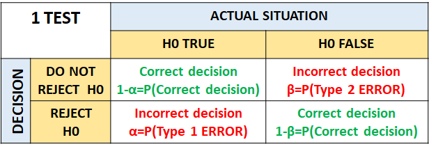
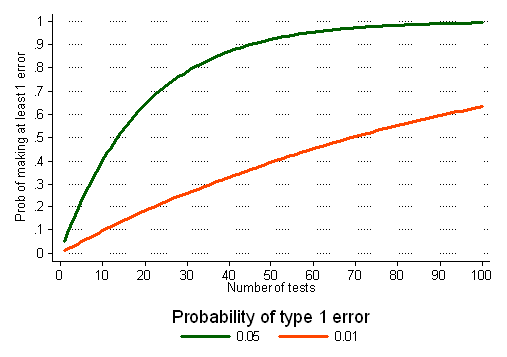
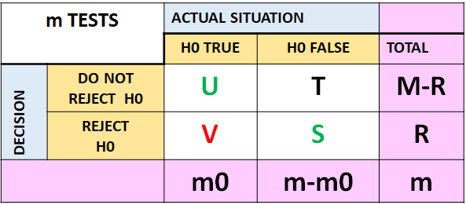

```{r setup, include=FALSE}
knitr::opts_chunk$set(echo = TRUE)
```

# Multiple testing outline

-   Reminder of concept associated with ONE hypothesis testing

-   Define the multiple testing problem and related concepts

-   Methods which address multiple testing

-   Correcting for multiple testing in R

-   The associated concept of power

# One hypothesis testing philosophy

-   Any experiment, no matter how well conducted, is subjected to events
    which can happen by chance

-   The world is not black and white -- statements often made terms of
    probabilities

-   Hypothesis testing is the art of testing if variation between two
    sample distributions can just be explained through random chance or
    not.

-   If we have to conclude that two distributions vary in a meaningful
    way, we must take enough precaution to see that the differences are
    not just through random chance.

-   We don't want to make an unwarranted hypothesis so we exercise a lot
    of care by minimizing the chance of its occurrence.

-   Also, equally important, if there is truly any difference between
    the two distributions, we don't want to miss it out and we would
    like enough confidence to ascertain it.

-   The table below summarizes all the needed elements of this setting

# One hypothesis testing and decisions - formal concepts



-   **P(Type1 error)=α**=the probability of incorrect rejection of a
    true null hypothesis.

-   **Type1 error= FALSE POSITIVE RESULT**

-   **P(Type 2 error)= β** =the probability of the failure to reject a
    false null hypothesis

-   **Type 2 error = FALSE NEGATIVE RESULT**

-   **Power = 1-β** =the probability that the null hypothesis is
    rejected, if a specific alternative hypothesis is true

-   A priori set values: usually **α=0.05, β=0.80 (0.90)**

-   A sample size large enough is necessary as determined by the effect
    size (difference we wish to see) and the two a-priori set values
    above

-   Why do we need all these? When holding an experiment - there are
    four elements intrinsically related

    -   **P(Type1 error)**

    -   **P(Type2 error)**

    -   **Effect size** - e.g. how large is the difference between two
        groups depends on the outcome/response/dependent variable

    -   **Sample size** - minimum necessary numbers to reach a
        meaningful conclusion following planning

# **Multiple testing - what is the problem?**

-   Genomics = Big data = Massive number of hypothesis tests may be
    necessary

-   A typical microarray experiment might result in performing 10000
    separate hypothesis tests. A standard **α-level** cut-off of 0.05
    for p-values, we would expect (0.05×10000=500) genes to be classed
    as "significant" just by chance.

If we perform [**m independent hypotheses tests**]{.ul} -- what is the
probability of at least 1 false positive?

{width="477"}

-   **P(making one error)**=$α$

-   **P(not making an error)**=$1-α$

-   **P(not making an error in m tests)**=$(1-α)^m$ -independency

-   **P(making at least 1 error in m tests)**=$1-(1-α)^m$

-   Old problem, same principles - but different approaches in classical
    and genetic epidemiology

# **How to count/assess errors in multiple testing?**



-   **m** = total number of tests

-   **m0** = is the number of true null hypotheses

-   **m - m0** = is the number of false null hypotheses

-   **U** = number of **TRUE NEGATIVES** (the tests not rejected when
    the null is true)

-   **V** = number of **FALSE POSITIVES** (the tests rejected when the
    null is true)

-   **T** = number of **FALSE NEGATIVES** (the tests not rejected when
    the null is not true)

-   **S** =number of **TRUE POSITIVES** (the tests rejected when the
    null is not true)

-   R = V + S is the total number of tests rejected.

-   In m hypotheses tests of which m0 are true null hypotheses, R is an
    observable random variable, and S, T, U, and V are all unobservable
    random variables.

# **How to count errors and what to do about it?**

-   Deterministic question: can we ever reach perfection? Deterministic
    answer: NO

-   What can we do then ?

    -   Controlling the type one error (false positives) rate in a
        probabilistic manner.

    -   Aim: minimize the type one error

-   [**Terminology:**]{.ul} adjusting the reference value for type one
    error (α) for the number of hypothesis tests performed

## Classical epidemiology - a couple of independent tests

-   [***Bonferroni correction***]{.ul} a very simple method for ensuring
    that the overall Type 1 error is maintained as planned when
    performing m independent hypothesis tests:

    -   In advance, we adjust the **α-level** of significance by the
        number of planned tests

    -   Rejects any hypothesis with a p-value: $p\le\frac{α}{m}$

    -   The software will calculate a new, adjusted p-value for each
        test $j$ , i.e. $p_j=min\{m\times p_j, 1\}$

-   Tukey -adjustments - post-hoc procedure associated with continuous
    outcomes

-   However, if $α=0.05$ and there are 10000 tests to be performed then
    only tests with a p-value less than $0.05/10000=5\times 10^{-6}$
    will be significant!

## Corrections associated with genetic epidemiology

-   **Family Wise Error Rate (FWER)**

    -   Single step procedure: similar adjustments made to each p-value

    -   Sequential procedure: adaptive adjustments made to each p-value

    -   Recommended when aiming to guard against ANY false positive

-   However, depending on the stage of the research, thinking in
    genomics may need to be more lenient during the first phases at
    least

-   False [***positive***]{.ul} rate:$FPR=\frac{V}{m0}$ designed to
    control the proportion of false positives out of all true actual
    situations (???)

-   False [***discovery***]{.ul} rate:$FDR=\frac{V}{R}$ **designed to
    control the proportion of false positives out of all rejections**

## **Benjamini and Hochberg FDR worked example - R**

-   To control FDR at a desirable level $\sigma$

-   Order the unadjusted p-values:$p_1\le p_2\le...\le p_n$

-   Finds the test with the highest rank $j$ for which the p-value,
    $p_j$ is less or equal to $\sigma\times\frac{j}{m}$

-   Declare the tests of rank $1, 2, ..., j$ as significant
    $p(j)<=\sigma\times\frac{j}{m}$

```{r }
###EXAMPLE 1
###An Example of the Benjamini-Hochberg Method 

##pvalues entered from smallest to largest
pvals<-c(.0008,.009,.165,.19,.205,.396,.450,.641,.781,.900, 0.993)##THERE ARE KINDS OF SORTING ALGORITHMS EVEN IN EXCEL

#enter the target FDR
sigma<-.05
#calculate the threshold for each p-value
threshold<-sigma*(1:length(pvals))/length(pvals)
#compare the p-value against its threshold and display results
cbind(pvals,threshold,pvals<=threshold)
```

-   Interpretation: the third column indicate the tests which reject the
    null (0 annotates no rejection, 1 annotates rejection)

```{r }

###EXAMPLE 2
###An Example of the Benjamini-Hochberg Method 

##pvalues entered from smallest to largest
pvals<-c(.01,.013,.014,.19,.35,.5,.63,.67,.75,.81)
#enter the target FDR
sigma<-.05
#calculate the threshold for each p-value
threshold<-sigma*(1:length(pvals))/length(pvals)
#compare the p-value against its threshold and display results
cbind(pvals,threshold,pvals<=threshold)

#calculate the term that appears in the innermost minimum function
test.p<-length(pvals)/(1:length(pvals))*pvals
length(test.p)

adj.p<-numeric(10)

#use a loop to run through each p-value and carry out the adjustment
for(i in 1:10) {
##THE MINIMUM VALUE OF THE SET OF VECTOR VALUES FROM i ONWARDS
adj.p[i]<-min(test.p[i:length(test.p)]) 

##IF THE ADJUSTED_p>1, THEN SET THE ADJUSTED_p TO 1, OTHERWISE SET IT TO adj.p
ifelse(adj.p[i]>1, 1, adj.p[i]) 
}
adj.p

#################################################
##################################################


###EXAMPLE 2 - ALTERNATIVE

p.adjust(pvals, method = "BH",     n = length(pvals))
p.adjust(pvals, method = "fdr", n = length(pvals))

##lists the original p-vales
cbind(pvals,test.p, threshold,pvals<=threshold, adj.p)


```

```{r }
###A Graphical Approach to the Benjamini-Hochberg Method

P_valuesRdata <-read.table("P_values_data_coma.txt", header=T,sep=",")
P_valuesRdata

real.p<-P_valuesRdata$real.p
#generate the values to be plotted on x-axis
x.values<-(1:length(real.p))/length(real.p)
#widen right margin to make room for labels
par(mar=c(4.1,4.1,1.1,4.1))
#plot points
plot(x.values,real.p,xlab=expression(k/m),ylab="p-value")
#add FDR line
abline(0,.05,col=2,lwd=2)
#add naive a line
abline(h=.05,col=4,lty=2)
#add Bonferroni-corrected a line
abline(h=.05/length(real.p),col=4,lty=2)
#label lines
mtext(c('naive','Bonferroni'),side=4,at=c(.05,.05/length(real.p)),las=1,line=0.2)
#select observations that are less than threshold
for.test<-cbind(1:length(real.p),real.p)
pass.test<-for.test[real.p<=.05*x.values,]
pass.test

#use largest k to color points that meet Benjamini-Hochberg FDR test
last<-ifelse(is.vector(pass.test),pass.test[1],pass.test[nrow(pass.test),1])
points(x.values[1:last],real.p[1:last],pch=19,cex=1.5)
###Adjusted p-values


```

-   Observe that [**all nine**]{.ul} of the species that pass the naive
    uncorrected .05 test also pass the Benjamini-Hochberg Step-up FDR
    test.

-   On the other hand [**only three**]{.ul} of the species pass the far
    stricter Bonferroni criterion.

-   Other methods of adjustment - just informative

```{r }
##the library below and functionalities goes through everything.
help(p.adjust)

p.adjust(pvals, method = "BH",    n = length(pvals))
p.adjust(pvals, method = "fdr",   n = length(pvals))


###a strong control of the family-wise error rate
p.adjust(pvals, method = "holm",       n = length(pvals))
p.adjust(pvals, method = "hochberg",   n = length(pvals))
p.adjust(pvals, method = "hommel",     n = length(pvals))
p.adjust(pvals, method = "bonferroni", n = length(pvals))


p.adjust(pvals, method = "BY",   n = length(pvals))
p.adjust(pvals, method = "none", n = length(pvals))


```
